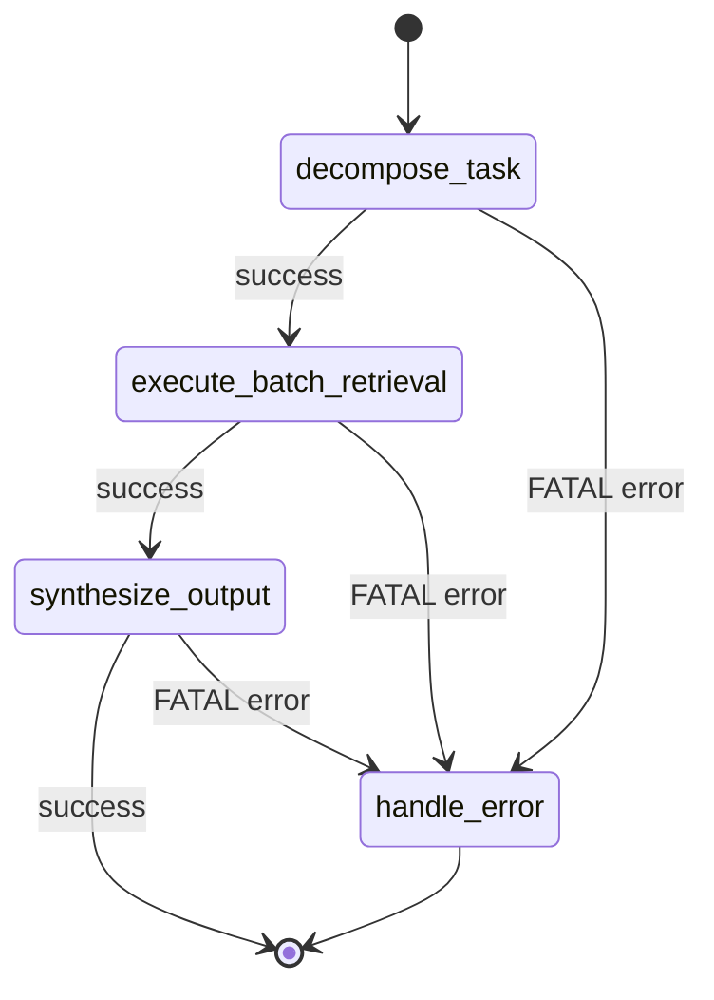
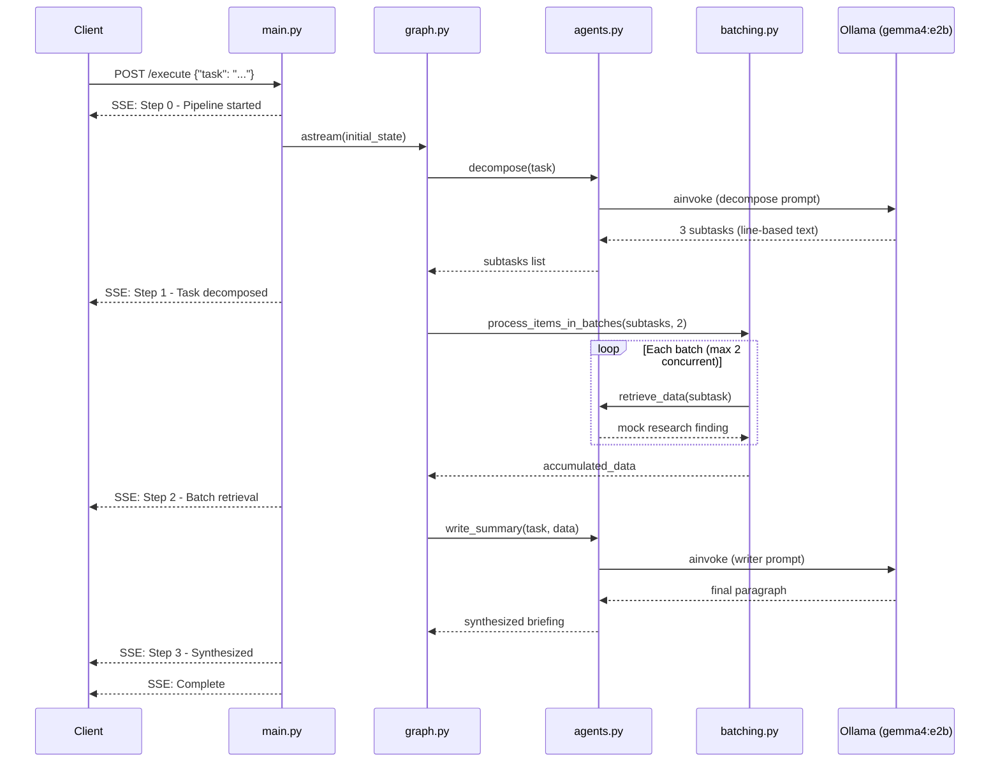
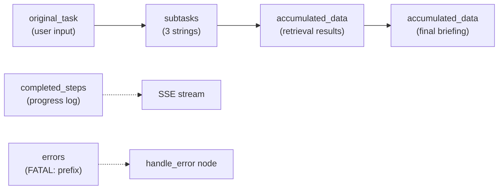

# Multi-Step Technical Briefing Engine

A lightweight, locally hosted **multi-step agent system** that decomposes a complex technical question into subtasks, retrieves context for each subtask, and synthesizes a cohesive briefing — all orchestrated by a manually defined **LangGraph state machine** and exposed via a **streaming FastAPI** endpoint.

Built for constrained hardware (4 GB VRAM / limited RAM) using **Ollama** with `gemma4:e2b` — no cloud APIs or API keys required.

---

## What It Does

Given a complex technical task (e.g. *"Explain how solar panels work and their environmental impact"*), the engine:

1. **Decomposes** the task into 3 focused subtasks using a local LLM.
2. **Retrieves** simulated research data for each subtask concurrently in small batches.
3. **Synthesizes** all findings into a single coherent briefing paragraph.
4. **Streams** real-time progress updates to the client via Server-Sent Events (SSE).

If any step fails after retries, the pipeline routes to a dedicated error handler and returns a graceful failure message instead of crashing.

---

## Architecture Overview

The system follows a **layered pipeline architecture** with clear separation of concerns:

```
┌─────────────────────────────────────────────────────────────────┐
│                     FastAPI Streaming Layer                     │
│                         (main.py)                               │
│              POST /execute  →  SSE event stream                 │
└────────────────────────────┬────────────────────────────────────┘
                             │
┌────────────────────────────▼────────────────────────────────────┐
│                  LangGraph State Machine                        │
│                       (graph.py)                                │
│   decompose_task → execute_batch_retrieval → synthesize_output  │
│                         ↓ (on FATAL error)                      │
│                      handle_error → END                         │
└──────┬──────────────────┬──────────────────┬────────────────────┘
       │                  │                  │
┌──────▼──────┐  ┌────────▼────────┐  ┌─────▼──────┐
│   agents.py │  │   batching.py   │  │  utils.py  │
│ Decomposer  │  │ Semaphore-based │  │   Retry    │
│ Retriever   │  │ async batching  │  │  decorator │
│ Writer      │  │                 │  │            │
└──────┬──────┘  └─────────────────┘  └────────────┘
       │
┌──────▼──────────────────────────────────────┐
│         ChatOllama (gemma4:e2b)              │
│         Local Ollama Runtime                  │
└───────────────────────────────────────────────┘
```

### LangGraph State Machine

The orchestrator is a manually defined `StateGraph` — no black-box agents. Each node reads from and writes to a shared `GraphState`.



### Request Lifecycle



### Data Flow Through State



---

## Project Structure

```
multi-step-agent-system/
├── requirements.txt    # Python dependencies
├── state.py            # GraphState TypedDict definition
├── agents.py           # LLM-powered Decomposer, Retriever, Writer
├── batching.py         # Manual asyncio batch concurrency
├── utils.py            # Retry decorator with exponential backoff
├── graph.py            # LangGraph state machine orchestrator
├── main.py             # FastAPI app with SSE streaming endpoint
├── test_system.py      # Pytest test suite (4 tests)
├── Tests.md            # Test case documentation
└── README.md           # This file
```

---

## Module Reference

### `state.py` — Graph State Definition

Defines the shared `GraphState` TypedDict used by every LangGraph node.

| Field | Type | Description |
|-------|------|-------------|
| `original_task` | `str` | The user's complex input task |
| `subtasks` | `list[str]` | Decomposed subtasks (up to 3) |
| `completed_steps` | `list[str]` | Append-only progress log (uses `operator.add` reducer) |
| `accumulated_data` | `list[str]` | Research findings, then final briefing (append-only) |
| `errors` | `list[str]` | Error messages; `FATAL:` prefix triggers error routing |

### `agents.py` — Specialized Agent Functions

Three distinct agent roles, all powered by `ChatOllama(model="gemma4:e2b", temperature=0)`:

| Agent | Function | Description |
|-------|----------|-------------|
| **Analyzer / Decomposer** | `decompose()` | Prompts the LLM to break a task into exactly 3 subtasks, one per line. Output is parsed with regex line-splitting (not JSON). Retries up to 2 times on parse failure. |
| **Retriever** | `retrieve_data()` | Mock async data fetcher. Simulates 500 ms latency per subtask with `asyncio.sleep`. Returns a templated research finding string. Retries up to 2 times. |
| **Writer** | `write_summary()` | Feeds all accumulated research notes to the LLM and asks for a single cohesive paragraph synthesizing the briefing. |

**Parsing strategy:** Because `gemma4:e2b` is a compact 2B-parameter model, prompts request simple line-based output. `parse_subtasks()` strips numbering/bullets and validates that at least one subtask was found.

### `batching.py` — Manual Async Batching

`process_items_in_batches(items, batch_size, process_func)` implements concurrency control without LangChain's `.abatch()`:

- Chunks items into batches of size `batch_size` (default: 2 in `graph.py`).
- Within each batch, runs tasks concurrently via `asyncio.gather`.
- Uses `asyncio.Semaphore` to cap in-flight tasks per batch.
- Processes batches sequentially to protect memory on constrained hardware.

### `utils.py` — Retry with Exponential Backoff

`@retry_with_backoff(max_retries=2, base_delay=0.5)` decorator that:

- Works with both sync and async functions.
- Retries up to 2 times (3 total attempts) before re-raising.
- Waits `0.5s → 1.0s` between attempts (exponential: `base_delay * 2^attempt`).
- Applied to `decompose()` and `retrieve_data()` in `agents.py`.

### `graph.py` — LangGraph Orchestrator

Manually built `StateGraph` with four nodes and conditional error routing:

| Node | Purpose |
|------|---------|
| `decompose_task` | Calls the Decomposer agent, writes subtasks to state |
| `execute_batch_retrieval` | Runs the Retriever across subtasks via batching |
| `synthesize_output` | Calls the Writer agent to produce the final briefing |
| `handle_error` | Records a graceful failure message when a `FATAL:` error is detected |

**Routing logic:** After each main node, a router checks for errors prefixed with `FATAL:`. If found, the graph transitions to `handle_error` instead of the next pipeline step.

### `main.py` — FastAPI Streaming API

| Endpoint | Method | Description |
|----------|--------|-------------|
| `/execute` | `POST` | Accepts `{"task": "..."}`, runs the graph, streams SSE events |

Each SSE event is a JSON payload:
```json
{"step": "Step 1: Task decomposed", "detail": "Task decomposed into subtasks", "node": "decompose_task"}
```

The stream emits events for: pipeline start → each graph node completion → pipeline complete.

### `test_system.py` — Test Suite

Four pytest tests (see [Tests.md](Tests.md) for details):

| Test | Validates |
|------|-----------|
| `test_process_items_in_batches_runs_concurrently` | Batch concurrency cap and ordered results |
| `test_retry_decorator_fails_twice_then_succeeds` | Retry on 2 failures, success on 3rd attempt |
| `test_route_after_decompose_to_error_on_fatal` | Conditional routing to error node |
| `test_graph_routes_to_error_node_on_catastrophic_failure` | End-to-end error handling via mocked failure |

---

## Features

| Feature | Implementation |
|---------|---------------|
| **Local LLM only** | `ChatOllama` via Ollama — no API keys, no cloud calls |
| **Memory-safe concurrency** | Batch size of 2, semaphore-limited async execution |
| **Robust parsing** | Line-based text parsing with try/except, not strict JSON schema |
| **Automatic retries** | Exponential backoff (2 retries) on decomposition and retrieval |
| **Graceful error handling** | `FATAL:` errors route to dedicated handler node |
| **Real-time streaming** | SSE via FastAPI `StreamingResponse` + `graph.astream()` |
| **Manual state machine** | LangGraph `StateGraph` defined node-by-node (no black-box agents) |
| **Lightweight dependencies** | 6 packages in `requirements.txt`, short system prompts |
| **Test coverage** | Batching, retry, routing, and end-to-end error path tested with mocks |

---

## Prerequisites

- **Python 3.11+**
- **Ollama** installed and running locally
- **gemma4:e2b** model pulled

---

## Getting Started

### 1. Install Dependencies

```bash
pip install -r requirements.txt
```

### 2. Start Ollama and Pull the Model

```bash
ollama pull gemma4:e2b
ollama serve
```

### 3. Run Tests

```bash
pytest test_system.py -v
```

Expected output: 4 passed.

### 4. Start the API Server

```bash
uvicorn main:app --reload
```

The server starts at `http://127.0.0.1:8000`. Interactive API docs are available at `http://127.0.0.1:8000/docs`.

### 5. Execute a Briefing

**Using curl (Windows PowerShell):**

```powershell
curl -N -X POST http://127.0.0.1:8000/execute `
  -H "Content-Type: application/json" `
  -d '{"task": "Explain how solar panels work and their environmental impact"}'
```

**Using curl (Linux/macOS):**

```bash
curl -N -X POST http://127.0.0.1:8000/execute \
  -H "Content-Type: application/json" \
  -d '{"task": "Explain how solar panels work and their environmental impact"}'
```

**Sample SSE output:**

```
data: {"step": "Step 0: Pipeline started", "detail": "Explain how solar panels work..."}

data: {"step": "Step 1: Task decomposed", "detail": "Task decomposed into subtasks", "node": "decompose_task"}

data: {"step": "Step 2: Processing batch retrieval", "detail": "Retrieved data for 3 subtasks", "node": "execute_batch_retrieval"}

data: {"step": "Step 3: Synthesizing final briefing", "detail": "Final briefing synthesized", "node": "synthesize_output"}

data: {"step": "Complete", "detail": "Pipeline finished"}
```

---

## Implementation Summary

This project was built incrementally across 7 discrete commits:

| Step | Commit | What Was Built |
|------|--------|----------------|
| 1 | `chore: setup requirements and define graph state` | `requirements.txt`, `state.py` with `GraphState` TypedDict |
| 2 | `feat: implement specialized agents using local ChatOllama` | `agents.py` — Decomposer, mock Retriever, Writer |
| 3 | `feat: add manual asyncio batching logic` | `batching.py` — Semaphore + gather batch processing |
| 4 | `feat: implement retry decorator with exponential backoff` | `utils.py` + retry applied to agents |
| 5 | `feat: build and compile LangGraph state machine` | `graph.py` — 4 nodes, conditional error routing |
| 6 | `feat: create FastAPI endpoint with streaming response` | `main.py` — POST `/execute` with SSE |
| 7 | `test: add system tests and documentation` | `test_system.py`, `Tests.md` — 4 passing tests |

### Design Decisions

- **No JSON schema enforcement** — `gemma4:e2b` may produce unreliable nested JSON; line-based parsing with regex cleanup is more robust.
- **Batch size of 2** — protects 4 GB VRAM and limited system RAM on the target hardware.
- **Mock retriever** — simulates I/O latency without external API dependencies; easily swappable for a real data source.
- **Short system prompts** — minimizes token usage and inference time on the 2B model.
- **No `pytest-asyncio` dependency** — async tests use `asyncio.run()` to keep `requirements.txt` minimal.

---

## Tech Stack

| Component | Package |
|-----------|---------|
| Web framework | FastAPI + Uvicorn |
| Orchestration | LangGraph |
| LLM integration | langchain-ollama (`ChatOllama`) |
| LLM runtime | Ollama (local, `gemma4:e2b`) |
| Concurrency | asyncio (Semaphore, gather) |
| Testing | Pytest |
